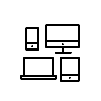

Hello, I am Mehdi Shabani Alishah. 👋

Welcome to my GitHub page! I am a software developer with interest and expertise in various programming languages. My skills include **Dart**, **Flutter**, **Java**, **Python**, and **JavaScript**. I also have considerable experience and knowledge in the fields of **HTML** and **CSS**.

I am currently in the process of learning and continuously improving my skills and am always looking for opportunities to increase my knowledge and experience in these areas.

If you have any questions or would like to collaborate, please contact me at mty4shabani@gmail.com. I look forward to hearing from you!

[my telegram](https://t.me/MtyNet) **@Mty_Shabani**

Thanks,
Mehdi

    
    
    
    
    
    
    
    
    
    
    
    
    
    
    
    
    
    
    
    
    
    
    
    
    
    
    
    
    
    

